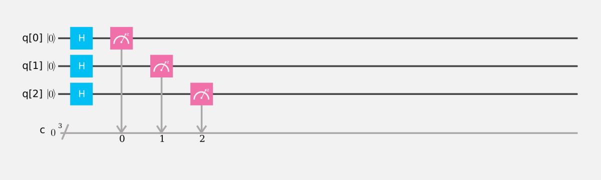
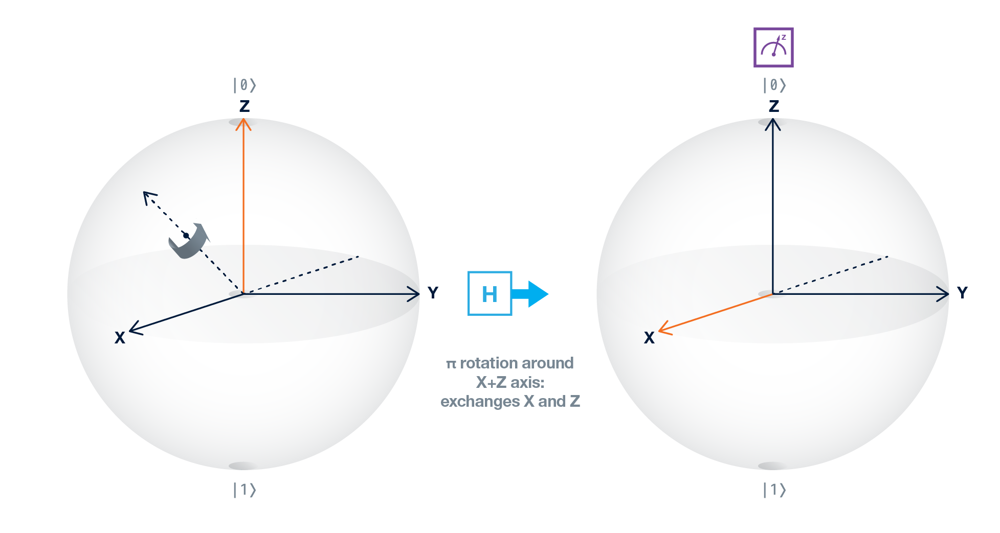

# 初学者指南

- 介绍
- 开始
  - 直方图表示（条状图）
- 量子比特 (Qubit) 奇怪又奇妙的世界
- 单量子比特门 (Single-Qubit Gates)
  - 产生叠加态 (Superposition)
  - 量子比特相位 (qubit phase) 介绍
  - 量子门总结
- 多量子比特门
- 量子纠缠 (Entanglement)
  - 贝尔和GHZ测试
  - 贝尔和GHZ测试（续）
  - GHZ测试量子实验结果

## [介绍](https://quantumexperience.ng.bluemix.net/qx/tutorial?sectionId=beginners-guide&page=002-Introduction~2F001-Introduction)

我们正处于信息革命新阶段的开端。第一阶段始于1950年左右，那时有一些昂贵的房间大小的计算机，仅供专家使用。今天，世界上有比人还要多的计算机，从通信到交通，商业和互联网，我们几乎所有事情都依赖计算机。我们所有的计算机的各种能力都是通过使用简单的操作如**与**，**或**和**非**（AND，OR，NOT）来操纵 0 和 1，这些操作也被称为逻辑门。通过在数十亿个地方每秒数十亿次的运算，让我们的世界以我们习以为常的方式运转。

35年来，IBM一直在研究一种完全不同的信息和信息处理方式，就像书中的梦想一样与普通的“经典”信息不同。与梦想不同，这种称为量子信息的新信息既易于理解又有用。量子信息的基本单位称为**量子比特**（qubit，发音为CUE-bit），用于存储和处理量子比特的机器称为**量子计算机**。多年来，我们一直在构建和测试功能越来越强大的量子计算机，去年我们在约克镇实验室安装了一个 5 量子比特的量子计算机，通过互联网向公众提供。换句话说，你现在手边就有一个可编程的量子计算机。我们很快就会升级我们的公共量子计算机，但即使是五个量子比特也足以让人进行量子计算。

量子理论是在20世纪初期发展起来，通过成功地解释像原子和电子这样的微小粒子的奇怪行为，彻底改变了物理学和化学。在二十世纪后期，人们发现它不仅适用于这些粒子，而且适用于信息本身。这导致了信息处理科学技术的革命，为新型计算和通信打开了大门。

通过本初学者指南，我们希望您将了解量子计算的不同之处，以及它开辟的新可能性。其中一些可能包括设计新材料和药物，更快地数据库搜索，以及用目前不可能的方式以惊人效率解线性方程组。要做到这一切，量子计算机将使用量子世界的两个基本属性：**叠加**（superposition）和**纠缠**（entanglement）。

所以，什么是**叠加**？量子比特可以处在 $\lvert 0 \rangle$ 态，$\lvert 1 \rangle$ 态，或者两者的线性组合（叠加）。与通常的比特表示不同的是，半角括号表示法（狄拉克标记） $\lvert \rangle$ 很方便的用来表示量子比特。当你测量 $\lvert 0 \rangle$ 量子态时，你得到一个经典的 0，当你测量 $\lvert 1 \rangle$ 量子态时，你得到一个经典的 1。在量子计算的许多物理实现中 $\lvert 0 \rangle$ 态有时被称为基态，包括我们的，因为它处在最低能量态中。

现在说说**纠缠**。纠缠是许多量子叠加的特性，并没有经典的类比。在一个纠缠态中，整个系统可以被明确地描述出来，尽管不能描述其部分。观察两个处于纠缠的量子比特的其中一个会导致其行为随机，但是却能精确地告诉观察者在同样的观察下另一个量子比特如何行为。纠缠包含了两个量子比特之间独立随机行为的一种关联，所以不能被用来发送消息。一些人称之为“远距离瞬时作用”，但是这只是用词不当。这里没有作用，而是关联；只有在两次测量后比较观察的结果才能检测两量子比特结果之间的关联。量子计算机拥有处于纠缠态的能力是它们额外计算能力的主要原因，也是许多其他的量子信息处理的功能，这些功能无法通过经典方式执行甚至描述。

想要学习更过关于叠加和纠缠的概念，可以看演员保罗·拉德在量子国际象棋游戏中击败史蒂芬·霍金的[视频](https://www.youtube.com/watch?v=Hi0BzqV_b44)。游戏规则见[这里](https://www.youtube.com/watch?v=jJoDKHKE2gA)，你也可以[观看](https://www.youtube.com/watch?v=LikdmXfWO2A&t=24s)游戏的发明者 Chris Cantwell，与国际象棋大师 Anna Rudolf 进行的一场友好的对局。

如果你想了解更多以上这些概念的数学和理论，我们鼓励你深入了解我们的完整用户指南。

## [开始](https://quantumexperience.ng.bluemix.net/qx/tutorial?sectionId=beginners-guide&page=003-Getting_Started~2F001-Getting_Started)

**Quantum Composer**（量子作曲家）是一个用于编程量子处理器的图形化用户界面。可以将其视为一种使用定义好的测量和门（改变量子比特状态的操作）来构建量子算法的工具。

通过本指南，你将会尝试许多不同的实验（也可以自己探索）。当你第一次单击 “Composer” 选项卡时，你将命名你的实验，并选择是在真正的量子处理器或是自定义的量子处理器（模拟器）上运行。如果选择自定义，你需要选择实验中量子比特的位数和经典寄存器中的比特位数（你可以保持其与量子比特位数相同）。在真实量子处理器中，量子比特之间可能的连接受实验设置的限制；由于实验缺陷，测量中也存在一些误差。然而在模拟的量子处理器中，量子门可以放置在任何地方。虽然没有实验错误，但你仍然会发现出现随机结果，这是由于量子信息的性质。在本指南中，我们将展示在模拟处理器上运行实验的结果（以避免由于实验误差产生的偏差给你带来的混淆）。我们建议你在自定义和真实的处理器上进行一些实验，以便了解其差异。

Composer 使你能够创建量子曲谱（quantum score）—— 不是运动比赛中的分数，而是指音乐意义上的。在量子曲谱中，就像音乐一样，时间从左到右进行。每条线代表一个量子比特（以及该量子比特随时间发生的变化）。与音符一样，每个量子比特具有不同的频率。量子算法（线路）首先准备好量子比特的态（例如，下面的图片中的 “$\lvert 0 \rangle$”），然后从左到右按时间执行一系列单量子和双量子比特门操作。

量子门由方框表示；它们播放不同长度，幅度和相位的频率。这些被称为单量子比特门。要将门应用于量子比特，只需将门拖到量子比特线谱上。双击方框或将其拖到垃圾箱即可删除。

一旦你使用所需的门和测量填充了线谱，单击 “Run”（仅适用于真实处理器）或 “Simulate” 就可以生成实验结果。每个线路必须以测量门结束才能运行实验。

**单量子比特测量：**

在上面的例子中，我们创建了一个单量子曲谱和一个寄存器中的经典比特。我们测量了量子比特 “0” 并将测量结果存储在经典位寄存器的第 0 个位置（曲谱下面标记为 “c” 的线）。

在执行量子测量之后，量子比特的信息变成经典比特，这意味着它失去了叠加和纠缠的量子特性。每个量子比特在测量中取值要么是 0，即量子比特在 $\lvert 0 \rangle$ 态下测量；或者 1，即量子比特在 $\lvert 1 \rangle$ 态下测量。有时你的量子比特有相同的概率是 $\lvert 0 \rangle$ 或 $\lvert 1 \rangle$，例如当它处于均等的叠加态时。在这种情况下，当你在真实设备上重复许多次实验（在 Simulate 的下拉菜单中称之为 “shots”，即1024次），你会发现有一半时候你测量得到 0 另一半时候测量为 1。

在 IBM Q Experience 中，你的量子曲谱结果以标准直方图/条形图表示形式显示。

## [直方图表示（条状图）](https://quantumexperience.ng.bluemix.net/qx/tutorial?sectionId=beginners-guide&page=003-Getting_Started~2F002-Histogram_representation_(Bar_graph))

在直方图/条状图表示中，每个柱条下面的 01 组合代表测量的量子比特态，高度则代表的是在不同的多次实验中该结果出现的频率。注意的是你用到的量子比特越多，表示结果用到的 01 就越多。为了节省空间，那些没有出现的结果在直方图中将被忽略，并且一些低频率的结果可能被合并放到标签为 “other values” 的条柱上。

**3-量子比特测量，基态**

**3-量子比特测量，全叠加态**

## [量子比特奇怪又奇妙的世界](https://quantumexperience.ng.bluemix.net/qx/tutorial?sectionId=beginners-guide&page=004-The_Weird_and_Wonderful_World_of_the_Qubit~2F001-The_Weird_and_Wonderful_World_of_the_Qubit)

量子比特是由两个能级组成的量子系统，标记为 $\lvert 0 \rangle$ 和 $\lvert 1\rangle$。$\lvert 0 \rangle$ 态经常被称为基态因为其在两个能量中更低的一个。$\lvert 0 \rangle$ 和 $\lvert 1 \rangle$ 一起组成所谓的 “标准基向量”。如所有向量一样，它们指向一个方向并具有一定的幅度。定义基向量是我们借用线性代数的一个非常有用的技巧。 基本思想是，一旦定义了这些向量，就可以从基向量的线性组合构造任何其他向量。

另外，量子比特也有 “相位”，那是因为叠加态比较复杂。为了表示这些叠加态，我们在态前面加上系数 $a$ 和 $b$，就像：$a \lvert 0 \rangle + b \lvert 1 \rangle$。这里公式说的是：“态是由 $\lvert 0 \rangle$ 和 $\lvert 1 \rangle$ 的线性组合构成，其中每个部分的比例取决于系数 $a$ 和 $b$ ”。系数 $a$ 和 $b$ 可能是正的，负的，甚至是复数。如果我们取 $a$ 和 $b$ 的绝对值然后平方（即 $\lvert a \rvert ^ 2$ 或 $\lvert b \rvert ^ 2$），我们可以得到测量出 0 或 1 结果的概率。

基本态 $\lvert 0 \rangle$ 和 $\lvert 1 \rangle$ 以及它们的线性组合 $a \lvert 0 \rangle + b \lvert 1 \rangle$ 描述了单个量子比特的状态。但是，因为系数 $a$ 和 $b$ 不仅仅是实数，也可能是虚数甚至复数，所以可视化量子比特需要一个叫做 **Bloch Sphere** 的特殊工具。Bloch Sphere（布洛赫球）是一个半径为 1 的球面，其表面上的一个点代表一个量子比特的态。就像地球使用经度和纬度来描述表面上的点一样，Bloch Sphere 也可以使用角度来描述量子比特的态。这种表示允许任何量子态，包括那些复系数。Bloch Sphere 表面上沿 X ，Y 或 Z 轴的点对应于如下所述的特殊状态。

量子态由图中的橙色线表示。在图中，球顶的态代表 $\lvert 0 \rangle$，球底的态代表 $\lvert 1 \rangle$。

当量子比特处在 $\lvert 0 \rangle$ 和 $\lvert 1 \rangle$ 的叠加态时，向量将指向这两点之间的某处（即角度 $\theta$ 在 0 到 180 度，或 $\pi$ 弧度之间）。

球上我们还有另外一个自由度：绕着 Z 轴的转动，这个用角度 $\phi$ 描述。当 $\phi$ 不为 0 时，表明量子比特的相位有改变。Bloch Sphere 描述仅用来表示单个量子比特。出于示意图的目的，我们假设 Bloch 向量的长度等于 Bloch 球的半径。

## [单量子比特门](https://quantumexperience.ng.bluemix.net/qx/tutorial?sectionId=beginners-guide&page=005-Single-Qubit_Gates~2F001-Single-Qubit_Gates)

正如经典计算机通过操纵比特 0 和 1 来执行计算一样，我们操纵量子比特以在量子计算机上执行计算。在本节中，我们将向你展示如何使用一些重要的单量子比特门。

要了解这些如何在数学上操作，请查看完整的用户指南。

### X 门

让我们从 X 门开始，通常被称为 “位翻转” ，因为它将 0 翻转为 1，反之亦然。

它也被称为 X 轴旋转，因为它将态向量围绕 X 轴旋转 $\pi$ 弧度。如果你从 Bloch 球的顶部的 $\lvert 0 \rangle$ 开始，X 门将你旋转到 Bloch 球底部（ $\lvert  1 \rangle$ ）。请参阅下面的原理图，并使用下面的量子曲谱在 Composer 中尝试 X 门。

## [产生叠加态](https://quantumexperience.ng.bluemix.net/qx/tutorial?sectionId=beginners-guide&page=005-Single-Qubit_Gates~2F002-Creating_superposition)

现在我们知道怎么转换 $\lvert 0 \rangle$ 和 $\lvert 1 \rangle$ ，那就让我们探索叠加态，其概念就是产生一个由基态 $\lvert 0 \rangle$ 和 $\lvert 1 \rangle$ 组成的新的量子态。为了实现叠加态，我们将扩展我们的量子门以包括 H 门。在 Quantum Composer 中，用标记为 H 的蓝色方形表示。

将 H 门，也称作 Hadamard 门，放到其中一个量子比特（其处于 $\lvert 0 \rangle$ 态）上面然后进行标准测量。你发现那个量子比特是一半时间表现为 $\lvert 0 \rangle$ ，一半时间为 $\lvert 1 \rangle$ 吗？在测量使得量子比特选择一种终态之前，量子比特的态既不是 $\lvert 0 \rangle$ 也不是 $\lvert 1 \rangle$ ，而是一种独特的量子态——叠加态，由相等权重的两种态组合而成。一个特例就是当 H 门应用到 $\lvert 0 \rangle$ 态得到的叠加态我们定义为：$\vert + \rangle = \frac{1}{\sqrt{2}}(\lvert 0 \rangle + \lvert 1 \rangle)$。这个我们叫做 $\lvert + \rangle$ 的新态有 1/2 的概率给出结果 0，1/2 的概率给出结果 1。你可以认为 H 门操作是绕着 X+Z 轴的旋转，如下图虚线所示。这个是叠加态的标准表示，**在 Bloch 球上沿 +X 轴指向**。

下面示例的一个直方图显示了运行上述量子线路 100 次的结果。 虽然平均而言我们期望这个线路以相同的概率产生0和1，但是任何有限的试验都不可能准确地产生这个结果，正如100个公平的硬币投掷通常不会恰好产生50个正面和50个反面。

与 $\vert + \rangle$ 一起的还有 $\vert - \rangle = \frac{1}{\sqrt{2}}(\lvert 0 \rangle - \lvert 1 \rangle)$，它是在 Bloch 球上沿 -X 轴指向的向量，我们可以定义一个新的基叫做叠加基（superposition basis）。 $\vert - \rangle$  态通过下面的线路得到。首先 X 门将 $\lvert 0 \rangle$ 翻转成 $\lvert 1 \rangle$ ，然后通过 H 门将其绕 X+Z 轴方向旋转得到 $\vert - \rangle$  态。当你运行该线路你会发现，就像前面一样，输出结果是均等的。不同的态给出相同的结果。

当你沿着标准的 Z 轴测量（这是我们通过 Z 测量门能够获取的唯一方向）时，我们不能够获取量子比特的相位信息。

为了能够区分这两者， $\vert + \rangle$ 和 $\vert  -\rangle$ ，我们需要在叠加基上测量。实验上，我们不能在 Bloch 球上沿着不同的方向物理测量；然而，我们可以使它看上去像我们改变了测量方式，通过在进行标准测量（只能沿 +Z 轴）前使用量子门旋转量子比特态。为了能沿 X 基测量，我们旋转量子比特态向量直到原来指向 X 轴的部分现在指向 +Z 方向，通过在测量前加上 Hadamard 门来完成。

沿 X 基测量 $\vert + \rangle$ ：

沿 X 基测量 $\vert - \rangle$ ：

试试上面的在 X 基上对叠加态 $\vert + \rangle$ 和 $\vert  -\rangle$ 的测量。你会发现 100% 结果是 0 和 1。也就是说，我们如果采取标准基（Z）测量，结果就会是完全随机。但是，在 X 基上，有确定的输出结果。

## [量子比特相位介绍](https://quantumexperience.ng.bluemix.net/qx/tutorial?sectionId=beginners-guide&page=005-Single-Qubit_Gates~2F005-Introducing_qubit_phase)

现在我们已经见到如何产生 $\lvert 0 \rangle$，$\lvert 1 \rangle$，和叠加态，让我们研究一些如何改变叠加态的相位。我们加上以下这些门：$Z$，$S$，$S^\dagger$，$T$，和 $T^\dagger$。

$Z$ 门是绕着 Z 轴旋转 $\pi$ 弧度，$S$ 门是绕着 Z 轴旋转 $\frac{\pi}{2}$ 弧度，$T$ 门是绕着 Z 轴旋转 $\frac{\pi}{4}$ 弧度。$S^\dagger$ 门是 $S$ 门的逆操作（绕着 Z 轴旋转 $-\pi$ 弧度；$SS^\dagger$ 返回原状态），同理 $T^\dagger$ 是 $T$ 的逆操作。这些旋转使得量子比特在 Bloch 球的 Y 轴上有一个分量，其是量子态里复数信息的表示。

当量子比特是 $\lvert 0 \rangle$ 态时，Z 门没有作用。但是当量子比特是 $\lvert + \rangle$ 态时，你会看到 Z 门将 $\lvert + \rangle$ 翻转到 $\lvert - \rangle$ 。

**Z 门：当量子比特为 $\lvert 0 \rangle$ 态**

**Z 门：当量子比特为 $\lvert + \rangle$ 态**

现在让我们看看绕 Z 轴旋转到中间部分的，初始态是 $\lvert + \rangle$ 叠加态。以下总结了围绕 Z 轴的不同旋转如何影响叠加基上的测量结果。

## [量子门总结](https://quantumexperience.ng.bluemix.net/qx/tutorial?sectionId=beginners-guide&page=005-Single-Qubit_Gates~2F006-Summary_of_quantum_gates)

## [多量子比特门](https://quantumexperience.ng.bluemix.net/qx/tutorial?sectionId=beginners-guide&page=006-Multi-Qubit_Gates~2F001-Multi-Qubit_Gates)

多个量子比特的状态标记与我们前面一直使用的相似，就是在 $\lvert \rangle$ （ket）符号里有更多的数字。对于两位量子比特处理器，该比特可以处在四个可能的态上：$\lvert 00 \rangle$，$\lvert 01 \rangle$，$\lvert 10 \rangle$ 和 $\lvert 11 \rangle$。按照从左到右的顺序，第一个数字代表第二个量子比特态，第二个数字代表第一个量子比特态。也就是说：**第一个量子比特（q0）总是在最右边**。我们选择这个标记是为了与经典的二进制表示一致。就像单量子比特一样，多量子比特也有叠加态，比如：$\frac{1}{\sqrt{2}}(\lvert 00 \rangle - \lvert 11 \rangle)$。当这个态被测量时，两个量子比特会有一样的值，50% 的时候都是 0，50% 的时候都是 1。

为了做一些有趣的事情并且利用量子世界中的那些构造，我们需要在量子比特之间执行条件逻辑（*conditional* logic）门，这意味着一个量子比特的状态取决于另一个量子比特的状态。

我们要用到的条件门是 Controlled-NOT，简写 CNOT。用下图中的元素表示：

CNOT 门作用到标准基上的态时，仅当控制比特为 $\lvert 1 \rangle$ 才会反转目标比特（作用 NOT 操作或是 X 门）；除此之外不做任何操作。

下面是 CNOT 门如何转变两量子比特（**第一个量子比特——即最右边的——是控制位**）：

尝试下面不同输入的 CNOT 线路例子。拖拽 CNOT 门到目标比特上然后点击控制比特来连接两者。

**CNOT（输入00）**

**CNOT（输入01）**

**CNOT（输入10）**

**CNOT（输入11）**

## [量子纠缠](https://quantumexperience.ng.bluemix.net/qx/tutorial?sectionId=beginners-guide&page=007-Entanglement~2F001-Entanglement)

我们现在来看纠缠，是所有量子现象里面最奇怪的。两个或多个量子物体缠绕在一起时，尽管相距太远而不能相互影响，但它们的行为表现为1) 单体随机，2) 但也有强关联——这个可以通过假设每个物体独立于另一个来解释。

纠缠态是一种由多个量子比特组成但不能列出各个量子比特的状态。比如，这些量子态：$\lvert 00 \rangle$，$\lvert 01 \rangle$，$\lvert 10 \rangle$ 和 $\lvert 11 \rangle$，没有一个是纠缠的因为它们都能被明确的表述出每个量子比特的状态。同样，$(\lvert 00 \rangle + \lvert 01 \rangle)/\sqrt{2}$ 也不是纠缠态，因为它可以被表述为第一个量子比特处于叠加的单量子态 $(\lvert 0 \rangle + \lvert 1 \rangle)/\sqrt{2}$，第二个处于 $\lvert 0 \rangle$ 态。然而，$(\lvert 01 \rangle + \lvert 10 \rangle)/\sqrt{2}$ 是纠缠的，因为无法描述单个量子比特的状态。当你测量这个态的一个量子比特时，不管沿着哪个轴测量，它的行为都是随机的，但是其随机的行为却能让你精确的预测出另一个量子比特在同样测量条件下的行为。没有任何非纠缠态能够表现出这样的完美个体随机性与完美关联的结合。

两个 Bell 态（纠缠态）例子：

有些人可能会发现这很难相信。 我们的经典直觉认为，直到测量前两个粒子不是存在于两个状态的叠加中，而是其中一个粒子一直是 1 而另一个是 0。 这被称为 “局部隐变量”（local hidden variable） 理论。

## [贝尔和GHZ测试](https://quantumexperience.ng.bluemix.net/qx/tutorial?sectionId=beginners-guide&page=007-Entanglement~2F002-Bell_and_GHZ_Tests)

为了最终解决上面说到的这个问题，John Bell 设计了一个实验叫贝尔测试（这个后来被扩展到 CHSH 不等式）。他意识到沿同一轴（例如 Z 方向）测量两个纠缠的量子比特总是给出互补的响应，但这可能有一个经典的解释（即预先确定结果的具体规则）。相反，贝尔意识到他可以沿不同方向对两个量子比特进行测量然后统计结果，可以用来说明粒子的行为不是经典的。描述这个工作需要了解统计学，所以这里我们不这样进行下去。相反，我们将引入更先进的多量子比特纠缠态。

让我们假设现在有三个，而不是两个量子比特。我们准备了一个所有量子比特处于全是 0 和 1 的叠加态：$\frac{1}{\sqrt{2}}(\lvert 000 \rangle - \lvert 111 \rangle)$。这个态称为 GHZ 态。GHZ 态名字来源于 Greenberger、Horne 和 Zeilinger，因为在 1997 年他们是第一个研究这个态的。通过对这个态进行一系列的测量，我们能够证明这种态违反了大多数人认为是关于我们世界的 “真理” 的某些假设。

经典地，粒子（在我们的例子中是量子比特）在测量时只能有两个结果中的一个—— 0 或 1。此外，如果它们是经典粒子，可能存在 “隐变量” 在测量前提前决定了结果。为了展现 GHZ 态的量子性质，并且证明没有所谓的隐变量存在，我们需要考虑沿不同基（X 和 Y）测量的可能结果的不同组合（称为关联）。这个详细地记录在 N. David Mermin 在 1990 年的论文《What’s wrong with these elements of reality?》中。

想象你有三个独立的系统，用蓝色，红色和绿色方框表示。你现在要解决以下问题：在每个框中有两个问题，标记为 X 和 Y，每个问题只有两个可能的结果，1 或 -1。这三个系统可能是三个纠缠的 GHZ 态量子比特。我们想仔细检查量子比特之间的关联。

为了这个例子的目的，我们将 $\lvert 0 \rangle$ 态映射到数字 1，$\lvert 1 \rangle$ 态到数字 -1，而不是映射 $\lvert 0 \rangle$ 态到数字 0，$\lvert 1 \rangle$ 态到数字 1（这个避免我们在过程中乘以 0 而丢失信息）。每个量子比特的测量结果是 1 或 -1，我们将结果相乘然后观察关联。

这里讲讲如何标记符号。让我们假设三个量子比特处于 $\lvert 000 \rangle$ 态。当我们在 Z 轴测量它们三个时，我们用 ZZZ 表示这个量子测量。根据上面定义的映射，结果将是 1、1、1 并且相乘后 ZZZ 是 1。如果是态 $\lvert 001 \rangle$，则进行 ZZZ 测量结果是 -1。

为了在其他基上测量，比如 XXX，我们需要在测量前对这些比特进行量子门操作旋转它们到 Z 轴。对于 XXX，意味着测量前需要给每个量子比特进行 Hadamard 门操作。我们也能对三个量子比特进行下面的测量和结果：

译者注：如果看了上面的内容感觉还是不太明白的话，可以看看这篇讲解的深入浅出的文章，[量子力学背后的数学复杂吗？](https://mp.weixin.qq.com/s/YRjZU1giwfJoJQavN6R9oA)。

## [贝尔和GHZ测试（续）](https://quantumexperience.ng.bluemix.net/qx/tutorial?sectionId=beginners-guide&page=007-Entanglement~2F003-Bell_and_GHZ_Tests_(Cont.))

这里我们来展现我们经典的直觉是错误的。

假设我们不是在量子系统上进行量子测量，而是在类似的 “经典” 系统上进行 “经典” 测量。为了区分两者，我们在经典系统上沿 X 方向的测量记为 “$M_X$”，Y 方向记为 “$M_Y$”。如果每个量子比特的结果（$M_X$或$M_Y$）在测量前就已经确定了，则我们可以把  “1” 或 “-1” 代入每个量子比特测量结果 $M_X$ 和 $M_Y$ 里面（尽管我们还不知道到底是 1 还是 -1）。因此下面任意一个都代表着 3 个量子比特的测量，我们需要沿着一列从上到下乘起来得到单个量子比特的结果（这里仍然假设结果是提前确定的并且相互独立）。

让我们相乘其中一列，比如，第 3 个量子比特。如你所见，我们得到 $M_X * M_Y * M_Y$。我们已经知道这些测量结果只能是两者中的一个：1 或 -1。也就是说，$M_Y * M_Y$ 的值是 1。所以，这个表达式可以简写为 $M_X$。当我们对所有列这样做时，我们可以发现以上等式可以等价于 $M_{X,Q3}M_{X,Q2}M_{X,Q1} = 1$。这个就是我们将会得到的结果，如果系统是经典的。然而，**量子力学和实验**都告诉我们对 GHZ 态的 XXX 测量结果是 $XXX = -1$！

基于这些实验的结果，我们不得不接受量子力学告诉我们的：每个独立于另外两个的量子比特态里没有隐藏的信息，使其在 X 和 Y 测量之前就确定了结果。任何给定量子比特的 X 或 Y 测量结果基本上与它所纠缠的量子比特的 X 或 Y 测量结果有关。比如，如果在量子比特 2 和 3 上的 Y 测量结果是 +1，则量子比特 1 上的 X 测量结果会是 +1。如果在量子比特 2 和 3 上的 X 测量结果是 +1，则量子比特 1 上的 X 测量结果会是 -1。奇怪但却是对的！

## [GHZ测试量子实验结果](https://quantumexperience.ng.bluemix.net/qx/tutorial?sectionId=beginners-guide&page=007-Entanglement~2F004-Results_from_the_GHZ_test_in_the_Quantum_Experience)

令人惊讶的是，我们可以在 Quantum Experience 中通过创建 GHZ 态来测试这一点，对三个量子比特应用量子门以使它们处于叠加和纠缠状态，并执行上述测量组合。当我们沿着 X 基测量这三个量子比特时，对比于我们沿 Y 基测量的前两个量子比特和沿 X 基测量的第三个量子比特，我们得到了等价于 “-1” 的情况。

我们的观察结果告诉我们，系统的行为正如量子力学预测的那样，而不是我们经典直觉预测的那样！

再次注意：如果我们在标准基上测量（沿 Z），我们只得到 000 和 111。 下表中的噪声（小误差）来自实验误差，因为我们使用的是真正的量子处理器，这是不完美的。

