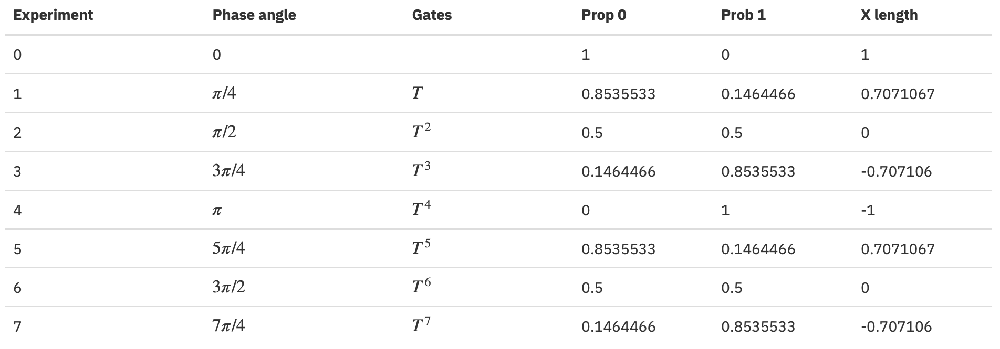
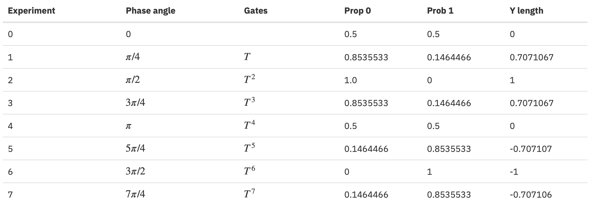
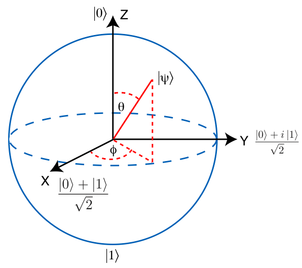
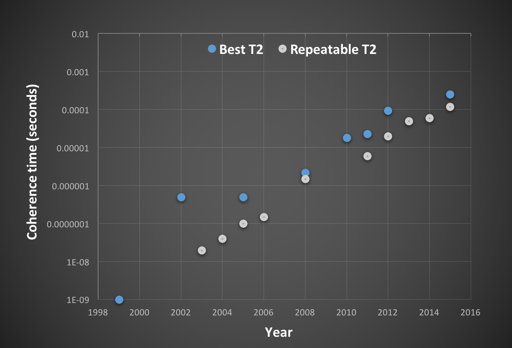

# 用户指南

- IBM Q Experience 介绍
  - 量子世界
  - Quantum Composer
  - 运行你的量子曲谱（Quantum Score）
  - 结果
- 量子比特奇怪又奇妙的世界
  - 量子比特（Qubit）
  - 产生叠加态 (Superposition)
  - 量子比特相位 (Qubit Phase) 介绍
  - 高级单量子比特门
  - 布洛赫球（Bloch Sphere）
  - 退相干（Decoherence）
- 多量子比特，量子门，以及纠缠态（Entangled State）
  - 多量子比特
  - 纠缠和贝尔实验
  - GHZ 态
- 量子算法
  - 基本线路标识和更大的线路
  - Grover 算法
  - Deutsch-Jozsa 算法
  - 学习平衡噪音
  - 量子相位估计
  - Shor 算法
- 量子纠错
  - 量子重复码
  - 稳定测量

## [IBM Q Experience 介绍](https://quantumexperience.ng.bluemix.net/proxy/tutorial/full-user-guide/001-The_IBM_Q_Experience/001-Introducing_the_IBM_Q_Experience.html)

量子计算就在当下。 虽然今天的量子处理器尺寸适中，但复杂性不断增长。 构建并参与新的量子学习者社区的时机已经成熟，因此我们改变了我们对计算的思考方式。 我们 IBM Q Experience 的目的是让你通过阅读本用户指南，编写自己的实验，在仿真中运行它们以及通过 IBM Cloud 在世界上第一个完全可控的量子处理器上执行它们来了解量子世界。

IBM Q Experience 有以下几个部分组成：

- 一套**教程**（本用户指南）将引导你从简单的单量子比特实验（第 II 部分）的基础知识到更复杂的多量子比特实验（第 III 部分），然后转向量子算法领域更先进的想法 （第 IV 节）和量子纠错（第 V 节）；
- **Quantum Composer**，是一个图形用户界面工具，你可以在其中创建自己的量子线路（我们称之为量子曲谱 **quantum score**），就像作曲家创作乐谱一样;
- 一个测试你的量子曲谱的模拟器；
- 能够访问 IBM Q 实验室中运行的真实量子处理器，你的量子曲谱将在其中执行；
- 一个**量子社区**，你可以分享和讨论你的量子曲谱，想法和经验。

请注意，IBM Quantum Experience 是一个 “活的实验”，我们不断对其进行更新。我们希望我们的用户可以通过提供反馈来帮助我们改进其功能并改进整体界面。在社区论坛中，请告诉我们你的改进意见，也请分享你遇到的任何很酷的曲谱和结果！如果你发现任何错误，请通过我们的错误跟踪器报告，可通过每页右下角的小错误图标访问。

为了确保每个人都有机会通过云端使用我们的实验室中的真实设备，我们建立了一个 **Units** 货币系统。 如果你已创建 IBM Q Experience 帐户，则可以完全访问我们的模拟功能以及先前在真实设备运行的缓存结果，以及花费少量的 Units 在量子处理器硬件上运行真实实验。 阅读完用户指南后，你将获得额外的 Units 奖励以进行更多实时实验。该系统允许我们的实验队列顺利运行。当你的 Units 用完时，一旦你查看完成的执行结果，你将得到补充。

我们实验室的量子处理器需要经常校准；在这些短时间内，你将收到 “Down for Calibration” 通知。如果我们需要执行维护，将显示 “Down for Maintenance” 消息。在这两种情况下，模拟都可供你继续学习和设计新实验。

对于那些希望直接创建自己的实验的人，可以直接跳到 Quantum Composer 章节。如果你希望首先提高对量子世界的理解，请继续阅读本用户指南，从量子世界章节开始。

## [量子世界](https://quantumexperience.ng.bluemix.net/qx/tutorial?sectionId=full-user-guide&page=001-The_IBM_Q_Experience~2F002-The_Quantum_World)

今天的计算机使用标准（作为物理学家会说，“经典”）计算模型执行计算和处理信息，其可以追溯到图灵和冯诺依曼。在这个模型中，所有信息都可以简化为比特，可以取 0 或 1 的值——所有处理都可以通过简单的逻辑门（AND、OR、NOT、NAND）一次作用于一个或两个比特来执行。在计算的任何一点，经典计算机的状态完全取决于其所有比特的状态，因此具有 n 个比特的计算机可以是 $2^n$ 之一中任意一种可能的状态，范围从 00...0 到 11...1。

与此同时，量子计算机的力量在于其更为丰富的各种状态。量子计算机也有比特——但不是 0 和 1，它的量子比特，或 qubits，可以表示 0、1 两者的线性组合，这是一种称为叠加的属性。这本身并不特别，因为计算机的比特介于 0 和 1 之间只是一台模拟（analog）计算机，几乎没有普通数字（digital）计算机那么强大。然而，量子计算机利用一种特殊的叠加，允许同时表示指数个逻辑状态，所有从 $\lvert 00...0 \rangle$ 到 $\lvert 11...1 \rangle$ 的态。这是一个强大的壮举，没有经典的计算机可以实现它。这些量子叠加中的绝大多数，以及对量子计算最有用的量子叠加都是纠缠在一起的——它们是整个计算机的状态，而不是用数字或模拟表示单个量子比特的状态。虽然没有像指数级多的经典计算机那么强大，但量子计算机比任何一台经典计算机都要强大得多——无论是确定性的，概率的还是模拟的。对于一些著名的问题（例如分解大数），相比经典计算机，量子计算机显然是胜利者。一台工作的量子计算机可以在一天内分解数字，而经典计算机需要数百万年。

人们可能会认为理解量子计算或量子物理学的难度在于 “hard math” ......但从数学上讲，量子概念只比高中代数复杂一点。量子物理很难是因为像爱因斯坦的相对论一样，它需要内化简单但反直觉的思想。相对论的奇怪之处在于时间和空间相互关联的概念，而常识告诉我们它们应该是独立作用。如果你一开始直接跳到时间和空间，来对新人解释相对论，你可能会得到一个茫然的凝视作为回报。更好的开始方式就像爱因斯坦所做的那样，通过解释相对论来自一个简单的物理原理：对于所有匀速移动的观察者来说，光速是相同的。这个谦虚的想法然后变得非常深刻，并且通过不可阻挡的逻辑引出爱因斯坦时空。

量子物理学的反直觉思想是：

1. 处于**确定状态**的物理系统仍可以**随机**行为。
2. 两个**相隔太远**而不能相互影响的系统仍然可以表现出，**各自随机**，但以某种方式**强关联**。

不幸的是，与相对论不同，这些结论并没有单一的简单物理原理。我们所能做的最好的事情就是将量子力学提炼成一些抽象的数学定律，从中可以推导出所有观察到的量子粒子（和量子计算机中的量子比特）的行为。而且，与相对论一样，我们必须避免试图用经典术语来描述量子概念。

## [Quantum Composer](https://quantumexperience.ng.bluemix.net/qx/tutorial?sectionId=full-user-guide&page=001-The_IBM_Q_Experience~2F003-The_Quantum_Composer)

Quantum Composer 是我们用于编程量子处理器的图形用户界面。熟悉量子计算的人可能会将  composer 视为使用定义好的门和测量操作构建量子线路的工具。对于那些不熟悉的人，我们将解释一些关键部分。

首次单击上面的 “Composer” 选项卡时，你可以选择运行实际量子处理器还是自定义量子处理器。在自定义处理器中，门可以放置在任何地方，而在实际处理器中，拓扑结果由我们实验室中运行的物理设备设置（请注意，这限制了一些双量子比特门的可用性）。

进入 “Composer” 选项卡后，你就可以开始制作自己的量子线路！

使用 Composer，你可以创建一个量子线路，我们有时将其称为量子曲谱，因为它在某些方面类似于乐谱。时间从左到右进行。每条线代表一个量子比特（以及该量子比特随时间发生的变化）。每个量子比特具有不同的频率，如音符。量子门由方框表示，它们播放不同长度，幅度和相位的频率。仅在一条线上的门被称为单量子比特门。用垂直线连接两个量子比特的门被称为 CNOT 门；这些双量子比特门的功能类似于传统数字逻辑中的异或门。CNOT 门实心点端的量子比特控制 $\oplus$ 端的目标量子比特，使其反转（因此叫受控制的NOT 或 CNOT）。有些门，比如 CNOT，有硬件限制；允许的连接集合由 Quantum Composer 下方的设备原理图以及最近校准的设备参数定义。

Quantum Composer 的库（位于量子比特面板的右侧）包含许多不同类别的门：单量子位门，例如黄色的空操作；绿色的泡利算子，代表比特翻转（X，相当于经典的NOT）；相位翻转（Z）；以及组合的比特翻转和相位翻转（Y）。我们还提供 Clifford 操作，这些是蓝色的门，例如 $H$、$S$ 和 $S^\dagger$ 门用来产生叠加态和复数量子相位，以及前面提到的两量子纠缠门 CNOT。红色的门是不属于 Clifford 组的两相门，对于量子计算非常重要。要测量任何量子比特的状态，请使用粉色的标准测量操作，这是一个简单的 Z 投影操作，将结果以经典比特的方式存到经典寄存器。灰色隔离线允许你分离线路的各个部分；当使用优化时，它会阻止工具跨越隔离线进行优化。如果您需要提醒，请点击 “帮助” 按钮（量子门标题栏附近的 **i** 标记），以快速了解所有可用的门操作。量子算法（线路）首先准备定义好状态的量子比特（这里是基态 $\lvert 0 \rangle$，我们已经为你自动完成了），然后执行一系列量子门，然后测量量子比特。

如果你勇气可嘉，可以点击 “高级” 按钮查看另一组门操作和子程序。这些当你继续阅读下去会得到解释。

要使用 Composer，只需将量子门拖到量子比特面板上即可放置它们。双击方框来删除。要放置 CNOT 门，首先拖动到目标量子比特上（$\oplus$  符号将出现），然后单击控制量子比特（将出现一个实心点）。请注意，在实际量子处理器上，测量门后面无法添加更多的门； 此功能将在未来添加。

加载下面的量子线路并尝试模拟，或开始编写自己的。 如果可能，我们将提供 OpenQASM 版本的线路，以及使用 QISKit 开源框架运行它的 Python 代码。

第一个曲谱

```OpenQasm
// My First Score
OPENQASM 2.0;
include "qelib1.inc";

// Register declarations
qreg q[2];
creg c[2];

// Quantum Circuit
// Pauli operations 
x q[0];
y q[1];
z q[0];
barrier q;
// Clifford operations
h q;
s q[0];
sdg q[1];
cx q[0],q[1];
barrier q;
// non-Clifford operations
t q[0];
tdg q[1];
barrier q;
// measurement operations
measure q -> c;
```

QISKit 例子

```python
# my_first_score.py
from qiskit import QuantumCircuit, QuantumRegister, ClassicalRegister, execute

# Define the Quantum and Classical Registers
q = QuantumRegister(2)
c = ClassicalRegister(2)

# Build the circuit
my_first_score = QuantumCircuit(q, c)
# Pauli operations 
my_first_score.x(q[0])
my_first_score.y(q[1])
my_first_score.z(q[0])
my_first_score.barrier(q)
# Clifford operations
my_first_score.h(q)
my_first_score.s(q[0])
my_first_score.s(q[1]).inverse()
my_first_score.cx(q[0],q[1])
my_first_score.barrier(q)
# non-Clifford operations
my_first_score.t(q[0])
my_first_score.t(q[1]).inverse()
my_first_score.barrier(q)
# measurement operations
my_first_score.measure(q, c)
 
# Execute the circuit
job = execute(my_first_score, backend = 'local_qasm_simulator', shots=1024)
result = job.result()

# Print the result
print(result.get_counts(my_first_score))
```

## [运行你的量子曲谱](https://quantumexperience.ng.bluemix.net/qx/tutorial?sectionId=full-user-guide&page=001-The_IBM_Q_Experience~2F004-Running_your_Quantum_Scores)

现在我们已经熟悉了 Composer，让我们来看看如何运行量子曲谱。

当你开始实验时，系统会提示你为其命名，以便稍后识别。你还将看到两个选项：Real Quantum Processor 或 Custom Topology。在这两种情况下，你都可以通过将量子门拖到曲谱上，添加测量门，然后点击 “运行” 要执行曲谱。

#### 在自定义量子处理器上运行

如果选择 “Custom Topology”，你唯一的选择是在模拟器中运行曲谱。这是因为自定义处理器允许任意连接；相反，真实设备受到物理连接的限制。选择自定义拓扑时，会出现一个对话框，要求你选择分配给不同寄存器的量子比特和经典比特数。我们将最大的量子比特数设置为 20。你的线路的执行很快（除非量子位数很大），然后可以在结果中查看输出（参见下一节）。 尝试下面的 “单 Qubit 测量”。

```
// Single Q Measurement
OPENQASM 2.0
include "qelib1.inc"

// Register declarations
qreg q[1];
creg c[1];

// Quantum Circuit
measure q -> c;
```

QISKit 例子

```python
# single_q_measurement.py
from qiskit import QuantumCircuit, QuantumRegister, ClassicalRegister, execute

# Define the Quantum and Classical Registers
q = QuantumRegister(1)
c = ClassicalRegister(1)

# Build the circuit
single_q_measurement = QuantumCircuit(q, c)
single_q_measurement.measure(q, c)

# Execute the circuit
job = execute(single_q_measurement, backend='local_qasm_simulator',shots=1024)
result = job.result()

# Print the result
print(result.get_counts(single_q_measurement))
```

#### 在真实量子处理器上运行（需要 Units）

如果选择 “Real Quantum Processor”，当你点击 “运行” 时，你编写的曲谱将被放入实验队列中，当你在我们实验室的真实量子计算机上执行时，你将收到电子邮件通知。

你必须在 IBM Q Experience 帐户中拥有 Units 才能使用真实量子处理器。如果你尝试运行的曲谱是之前已经运行的，你将可以选择立即查看缓存执行的结果（不需要 Units），或者花费 Units 将曲谱作为新的重新运行（意味着它将进入实验队列，完成后你将收到电子邮件通知）。

请注意，本用户指南中的许多示例都有以前的执行可供你查看和试验。

点击 “运行” 后，你的曲谱进度将显示在 composer 下方的 “Quantum Scores” 选项卡中，并按执行日期排序。一旦结果出来后，你将可以从此选项卡中查看它们。你还可以在等待结果返回时重新编辑曲谱并在模拟器上执行。

## [结果](https://quantumexperience.ng.bluemix.net/qx/tutorial?sectionId=full-user-guide&page=001-The_IBM_Q_Experience~2F005-The_Results)

在我们的系统中（标准的），测量是在计算基础上进行。在测量之后，量子比特的信息变成经典比特。 如果在态 $\lvert 0 \rangle$ 时测量量子比特，则测量值为 0，如果量子比特在态 $\lvert 1 \rangle$ 时测量，则值为1。

运行给定的具有 n 个测量的量子线路，测量结果将是 $2^n$ 个可能的 n 位二进制字符串中的一个。如果再次运行实验，即使测量是完美的且没有误差，由于量子物理学基本的随机性，结果可能不同。量子线路的多次运行结果可以表示为整个 $2^n$ 个可能结果的分布。它不能扩展来代表所有可能的结果；因此，我们只保留在给定实验中发生的那些结果，并将它们表示为直方图。

直方图/条形图表示很容易理解。条形的高度表示在实验期间该结果发生的占比。仅包括至少发生过一次的那些结果。如果所有条形图都太小而无法显示，则将它们收集到称为 “other values” 的单个条形图中。一般来说这不是问题，因为好的量子线路不应该有很多结果；只有在终态是一个大叠加态的线路才会产生许多结果，而这将需要指数测量。

## [量子比特奇怪又奇妙的世界](https://quantumexperience.ng.bluemix.net/qx/tutorial?sectionId=full-user-guide&page=002-The_Weird_and_Wonderful_World_of_the_Qubit~2F000-The_Weird_and_Wonderful_World_of_the_Qubit)

在本节中，我们将向您介绍量子比特。量子比特（发音为 “cue-bit” ）是量子信息的物理载体；换句话说，它是一个量子版本的比特，量子计算围绕着它进行。

## [量子比特](https://quantumexperience.ng.bluemix.net/qx/tutorial?sectionId=full-user-guide&page=002-The_Weird_and_Wonderful_World_of_the_Qubit~2F001-The_Quantum_Bit_(Qubit))

在这个章节你将看到量子比特。你还将看到一些数学符号，包括线性代数中的一些概念。量子比特是由两个层次组成的量子系统，标记为 $\lvert 0 \rangle$ 和 $\lvert 1 \rangle$ （这里我们使用狄拉克符号）。它由复数 $\C^2$ 上的二维向量空间表示。这意味着量子比特需要两个复数才能完全描述它。计算（或标准）基对应于 $\lvert 0 \rangle$ 和 $\lvert 1 \rangle$ 两个级别，对应于以下向量：

$$\lvert 0 \rangle = \left( \begin{array}{c} 1 \\ 0 \end{array} \right) \qquad  \lvert 1 \rangle = \left( \begin{array}{c} 1 \\ 0 \end{array} \right)$$

量子比特并不总是必须在 $\lvert 0 \rangle$ 或 $\lvert 1 \rangle$ ；它可以处于任意量子态，表示为 $\lvert \psi \rangle$，可以是任何基矢量的叠加 $\lvert \psi \rangle = \alpha \lvert 0 \rangle + \beta \lvert 1 \rangle$。叠加量 $\alpha$ 和 $\beta$ 是复数；他们一起服从 $\vert \alpha \vert^2 + \vert \beta \vert^2 = 1$。

当测量或观察量子系统时会发生有趣的事情。量子测量由波尔规则（Born rule）描述。特别的地方是，如果处于某个态的量子比特  $\lvert \psi \rangle$ 在标准基上测量，以概率 $\vert \alpha \vert^2$ 得到结果 0 并且，以互补概率 $\vert \beta \vert^2$ 获得结果 1。有趣的是，量子测量将任何量子比特的叠加态，根据叠加态参数给出的概率，投影到态 $\lvert 0 \rangle$ 或态 $\lvert 1 \rangle$ 上去。

这里我们描述的是量子比特的抽象概念。你在 IBM Q Experience 中与之交互的原型量子计算机使用的是比特称为超导传输量子比特（superconducting transmon qubit），其由在硅衬底上图案化的诸如铌和铝的超导材料制成。物理上，为了使这个超导量子比特像量子比特的抽象概念一样，该设备必须处于极低的温度。在 IBM Quantum Lab 中，我们将温度保持在如此冷（在稀释制冷机中为 15 mK），因此没有环境噪音或热量来激发超导量子比特。一旦我们的系统足够冷，经过几天，超导量子比特将平衡到基态 $\lvert 0 \rangle$。

要了解 “基态” 的含义，请尝试在模拟模式下运行下面的曲谱文件（或查看真实设备上的一些缓存运行结果）。这里，量子比特初始为基态 $\lvert 0 \rangle$ 然后是标准测量。根据你的执行结果，你应该在模拟模式中看到（使用真实设备运行也有非常高的概率），量子比特仍然处于基态。真实设备中的任何误差都是由于量子比特的不完美测量以及残余热量造成的。

**单量子比特测量**

```
// Single Q Measurement
OPENQASM 2.0;
include "qelib1.inc";

// Register declarations
qreg q[1];
creg c[1];

// Quantum Circuit
measure q -> c;
```

QISKit 例子

```python
# single_q_measurement.py
from qiskit import QuantumCircuit, QuantumRegister, ClassicalRegister, execute

# Define the Quantum and Classical Registers
q = QuantumRegister(1)
c = ClassicalRegister(1)

# Build the circuit
single_q_measurement = QuantumCircuit(q, c)
single_q_measurement.measure(q, c)
 
# Execute the circuit
job = execute(single_q_measurement, backend = 'local_qasm_simulator', shots=1024)
result = job.result()

# Print the result
print(result.get_counts(single_q_measurement))
```

你可能已经猜到了，我们还需要能够将量子比特放在其他态。为此，我们需要量子门（quantum gate）的概念。 单量子比特门是 $2\times2$  酉矩阵（unitary matrix，因为量子门必须是可逆的并且保持概率幅度，所以矩阵必须是单位矩阵）。通过将原始量子态乘以量子门$\lvert \psi^\prime \rangle = U\lvert \psi \rangle$即是经过门操作后的量子态 $\lvert \psi^\prime \rangle$。 这里 $U$ 代表量子门。

最简单的量子门是不同翻转门，记为 $X$。它将 $\lvert 0 \rangle \rightarrow X\lvert 0 \rangle = \lvert 1 \rangle$；换言之，它把 0 翻转为 1，反之亦然。这与经典的非门相似，矩阵表示如下

$$ X = \left(\begin{array}; 0 & 1 \\ 1 & 0 \end{array}\right) $$

在 Composer 中，它由绿色的方框给出，中间有一个 X。 尝试运行下面的示例文件，你是否发现，与上面的示例不同，量子比特最终处于激活态 $\lvert 1 \rangle$ ？

激活态

```
// Excited State
OPENQASM 2.0;
include "qelib1.inc";

// Register declarations
qreg q[1];
creg c[1];

// Quantum Circuit
x q[1];
measure q -> c;
```

QISKit 例子

```python
# excited_state.py
from qiskit import QuantumCircuit, QuantumRegister, ClassicalRegister, execute

# Define the Quantum and Classical Registers
q = QuantumRegister(1)
c = ClassicalRegister(1)

# Build the circuit
excited_state = QuantumCircuit(q, c)
excited_state.x(q)
excited_state.measure(q, c)

# Execute the circuit
job = execute(excited_state, backend = 'local_qasm_simulator', shots=1024)
result = job.result()

# Print the result
print(result.get_counts(excited_state))
```

## [产生叠加态](https://quantumexperience.ng.bluemix.net/qx/tutorial?sectionId=full-user-guide&page=002-The_Weird_and_Wonderful_World_of_the_Qubit~2F002-Creating_superpositions)

到目前为止，我们的系统表现得像经典的比特。要想超越经典行为，我们必须探索如何实现叠加。产生叠加的操作是 Hadamard 门，$H$。在 Composer 中，这是标记为 $H$ 的蓝色门操作。

下面给出一个进行叠加的简单曲谱。首先放置 $H$ 门在其中一个量子比特（处于 $\lvert 0 \rangle$ 态）上然后进行标准测量。运行以下示例。

```
// Superposition State
OPENQASM 2.0;
include "qelib1.inc";

// Register declarations
qreg q[1];
creg c[1];

// Quantum Circuit
h q;
measure q -> c;
```

QISKit 例子

```python
# superposition_state.py
from qiskit import QuantumCircuit, QuantumRegister, ClassicalRegister, execute

# Define the Quantum and Classical Registers
q = QuantumRegister(1)
c = ClassicalRegister(1)

# Build the circuit
superposition_state = QuantumCircuit(q, c)
superposition_state.h(q)
superposition_state.measure(q, c)

# Execute the circuit
job = execute(superposition_state, backend = 'local_qasm_simulator', shots=1024)
result = job.result()

# Print the result
print(result.get_counts(superposition_state))
```

你发现没有，结果一半时候是 0，一半时候是 1。实际上，就像翻转一枚硬币一样，结果接近 50/50（由于噪音和误差，在真实设备上运行会得到的不是理想的结果）。

然而，量子随机性是非常不同的。我们来看看是怎么样的。再次运行实验，但是这次有两个串联的 $H$ 门。如果我们考虑 $H$ 门是模拟硬币翻转，这里我们将翻转它两次。当你连续两次翻转硬币时，你期望的分布仍然是 50/50。以下是该实验的量子曲谱；运行示例。

```
//Superposition State in X Basis
OPENQASM 2.0;
include "qelib1.inc";

// Register declarations
qreg q[1];
creg c[1];

// Quantum Circuit
h q;
barrier q;
h q;
measure q -> c;
```

QISKit 例子

```python
# superposition_state_xbasis.py
from qiskit import QuantumCircuit, QuantumRegister, ClassicalRegister, execute

# Define the Quantum and Classical Registers
q = QuantumRegister(1)
c = ClassicalRegister(1)

# Build the circuit
superposition_state_xbasis = QuantumCircuit(q, c)
superposition_state_xbasis.h(q)
superposition_state_xbasis.barrier()
superposition_state_xbasis.h(q)
superposition_state_xbasis.measure(q, c)

# Execute the circuit
job = execute(superposition_state_xbasis, backend = 'local_qasm_simulator', shots=1024)
result = job.result()

# Print the result
print(result.get_counts(superposition_state_xbasis))
```

这一次，结果令人惊讶。与经典情况不同，结果不是随机的，而是以很高的概率在 $\lvert 0 \rangle$ 态。量子随机性不能简单的类比于经典的随机硬币翻转。在上述两个实验中，系统（无噪声）处于确定状态，但仅在第一种情况下，它表现为随机。这是因为，在第一种情况下，通过 $H$ 门，我们产生了一个均衡基态和激活态的叠加态，$\lvert + \rangle = (\lvert 0 \rangle + \lvert 1 \rangle)/\sqrt{2}$，然后在标准基上进行测量。标准基上的测量行为迫使系统以相同概率选择处于 $\lvert 0 \rangle$ 或 $\lvert 1 \rangle$ 态。在第二种情况下，我们可以认为第二个 $H$ 门是最终测量操作的一部分；它将测量基从标准基改变为新的基——我们称之为叠加基或 x 基。实验通过给出结果 0 来证实这一点，表明系统处在 $\lvert + \rangle$ 叠加态。

在我们给出数学解释之前，让我们再考虑两个实验。第一个将量子比特置于激发态，然后应用 $H$ 门。曲谱见下；运行它，你将看到我们得到与第一个实验相同的 50/50 统计数据。

```
//Negative Superposition State
OPENQASM 2.0;
include "qelib1.inc";

// Register declarations
qreg q[1];
creg c[1];

// Quantum Circuit
x q;
h q;
measure q -> c;
```

QISKit 例子

```python
# negative_superposition_state.py
from qiskit import QuantumCircuit, QuantumRegister, ClassicalRegister, execute

# Define the Quantum and Classical Registers
q = QuantumRegister(1)
c = ClassicalRegister(1)

# Build the circuit
negative_superposition_state = QuantumCircuit(q, c)
negative_superposition_state.x(q)
negative_superposition_state.h(q)
negative_superposition_state.measure(q, c)

# Execute the circuit
job = execute(negative_superposition_state, backend = 'local_qasm_simulator', shots=1024)
result = job.result()

# Print the result
print(result.get_counts(negative_superposition_state))
```

第二个实验包括：首先准备激发态量子比特，应用 $H$ 门（将其置于叠加态），然后在 x 基上测量（另一个 $H$ 门然后进行测量）。这次我们有很大的可能发现系统给出结果 1。这告诉我们，在 x 基测量之前的态是与 $\lvert + \rangle$ 正交的叠加态。根据定义，该态必须是 $\lvert - \rangle = (\lvert 0 \rangle - \lvert 1 \rangle)/\sqrt{2}$。也就是说， $H$ 门将标准基转换为新的基，叠加基，由集合 $\{\lvert + \rangle, \lvert - \rangle \}$ 定义。

**x 基上的负叠加态**

```
//Negative Superposition State X Basis
OPENQASM 2.0;
include "qelib1.inc";

// Register declarations
qreg q[1];
creg c[1];

// Quantum Circuit
x q;
h q;
barrier q;
h q;
measure q -> c;
```

QISKit 例子

```python
# negative_superposition_state_xbasis.py
from qiskit import QuantumCircuit, QuantumRegister, ClassicalRegister, execute

# Define the Quantum and Classical Registers
q = QuantumRegister(1)
c = ClassicalRegister(1)

# Build the circuit
negative_superposition_state_xbasis = QuantumCircuit(q, c)
negative_superposition_state_xbasis.x(q)
negative_superposition_state_xbasis.h(q)
negative_superposition_state_xbasis.barrier()
negative_superposition_state_xbasis.h(q)
negative_superposition_state_xbasis.measure(q, c)

# Execute the circuit
job = execute(negative_superposition_state_xbasis, backend = 'local_qasm_simulator', shots=1024)
result = job.result()

# Print the result
print(result.get_counts(negative_superposition_state_xbasis))
```

$H$ 门的矩阵表示为

$$ H = \frac{1}{\sqrt{2}}\left( \begin{array}{cc} 1 & 1 \\ 1 & -1 \end{array} \right) $$

应用此门到 $\lvert 0 \rangle$ 态得到

$$ H\lvert 0 \rangle = \frac{1}{\sqrt{2}}\left( \begin{array}{cc} 1 & 1 \\ 1 & -1 \end{array} \right) \left( \begin{array}{c} 1 \\ 0  \end{array} \right) = \frac{1}{\sqrt{2}}\left( \begin{array}{c} 1 \\ 1  \end{array} \right) = \lvert + \rangle $$

应用此门到 $\lvert 1 \rangle$ 态得到

$$ H\lvert 0 \rangle = \frac{1}{\sqrt{2}}\left( \begin{array}{cc} 1 & 1 \\ 1 & -1 \end{array} \right) \left( \begin{array}{c} 0 \\ 1  \end{array} \right) = \frac{1}{\sqrt{2}}\left( \begin{array}{c} 1 \\ -1  \end{array} \right) = \lvert - \rangle $$

这些矩阵直接导致上面所见的量子随机性。你还了解了量子叠加，并且这些叠加可以有一个符号。我们希望你从本章中掌握的主要信息是：

- 处于确定状态的物理系统仍可以行为随机

这是量子世界章节里两个原则中的第一个。这个需要成为你的新直觉，因为它使量子系统不同于经典系统。

## [量子比特相位介绍](https://quantumexperience.ng.bluemix.net/qx/tutorial?sectionId=full-user-guide&page=002-The_Weird_and_Wonderful_World_of_the_Qubit~2F003-Introducing_qubit_phase)

在前两节中，我们讨论了比特翻转和 Hadamard 门。这些允许我们产生单量子比特态 $\{ \lvert 0 \rangle, \lvert 1 \rangle, \lvert + \rangle, \lvert - \rangle \}$，以及量子叠加态。然而，一般单量子比特态还具有更多的可能态。我们之前提到过，一个单量子态可以写作 $\lvert \psi \rangle = \alpha \lvert 0 \rangle + \beta \lvert 1 \rangle$，其中 $\alpha$ 和 $\beta$ 是复数且 $\vert \alpha \vert^2 + \vert \beta \vert^2 = 1$。此外，量子态的整个相位是不可检测的；因此，$\lvert \psi \rangle$ 与 $e^{i\gamma}\lvert \psi \rangle$ 相同。

单量子比特态另一种满足这些条件的表示可以写成

$$ \lvert \psi \rangle = \sqrt{p}\lvert 0 \rangle + e^{i\phi}\sqrt{1-p}\lvert 1 \rangle $$

其中 $0 \le p \le 1$ 是比特处于 0 态的概率，$0 \le \phi \le 2\pi$ 是量子相位。由 $\{H, T\}$ 生成的量子门集合，能够产生所有不同 $p$ 和 $\phi$ 值的态。在后面的部分中，我们将展示如何在原则上完成此操作，并在 IBM Q Experience 中引入高级门以提供更好的控制。然而首先，我们通过实验 $T$ 门来建立对量子相位的直觉。$T$ 门将相位旋转 $\pi/4$，用矩阵表示为

$$ T = \left( \begin{array}{cc} 1 & 0 \\ 0 & e^{i\pi/4} \end{array} \right) $$

如果我们的系统从初态 $\lvert + \rangle$ 开始（使用 Hadamard 门完成），然后应用多个 $T$ 门以及在 x 基上的测量，我们就可以将这个相位映射出来。这些实验由以下八个曲谱给出：

```
//Quantum Phase exp 0
OPENQASM 2.0;
include "qelib1.inc";

// Register declarations
qreg q[1];
creg c[1];

// Quantum Circuit
h q;
barrier q;
// None
barrier q;
h q;
measure q -> c;
```

```
//Quantum Phase exp 1
OPENQASM 2.0;
include "qelib1.inc";

// Register declarations
qreg q[1];
creg c[1];

// Quantum Circuit
h q;
barrier q;
t q;
barrier q;
h q;
sdg q;
measure q -> c;
```

```
//Quantum Phase exp 2
OPENQASM 2.0;
include "qelib1.inc";

// Register declarations
qreg q[1];
creg c[1];

// Quantum Circuit
h q;
barrier q;
t q;
t q;
barrier q;
h q;
measure q -> c;
```

```
//Quantum Phase exp 3
OPENQASM 2.0;
include "qelib1.inc";

// Register declarations
qreg q[1];
creg c[1];

// Quantum Circuit
h q;
barrier q;
t q;
t q;
t q;
barrier q;
h q;
measure q -> c;
```

```
//Quantum Phase exp 4
OPENQASM 2.0;
include "qelib1.inc";

// Register declarations
qreg q[1];
creg c[1];

// Quantum Circuit
h q;
barrier q;
t q;
t q;
t q;
t q;
barrier q;
h q;
measure q -> c;
```

```
//Quantum Phase exp 5
OPENQASM 2.0;
include "qelib1.inc";

// Register declarations
qreg q[1];
creg c[1];

// Quantum Circuit
h q;
barrier q;
t q;
t q;
t q;
t q;
t q;
barrier q;
h q;
measure q -> c;
```

```
//Quantum Phase exp 6
OPENQASM 2.0;
include "qelib1.inc";

// Register declarations
qreg q[1];
creg c[1];

// Quantum Circuit
h q;
barrier q;
t q;
t q;
t q;
t q;
t q;
t q;
barrier q;
h q;
measure q -> c;
```

```
//Quantum Phase exp 7
OPENQASM 2.0;
include "qelib1.inc";

// Register declarations
qreg q[1];
creg c[1];

// Quantum Circuit
h q;
barrier q;
t q;
t q;
t q;
t q;
t q;
t q;
t q;
barrier q;
h q;
measure q -> c;
```

QISKit 例子

```python
# quantum_phase.py
import numpy as np
from qiskit import QuantumCircuit, QuantumRegister, ClassicalRegister, execute

# Define the Quantum and Classical Registers
q = QuantumRegister(1)
c = ClassicalRegister(1)

# Build the circuits
circuits = []
pre = QuantumCircuit(q, c)
pre.h(q)
pre.barrier()
middle = QuantumCircuit(q, c)
meas_x = QuantumCircuit(q, c)
meas_x.barrier()
meas_x.h(q)
meas_x.measure(q, c)
exp_vector = range(0,8)
for exp_index in exp_vector:
    circuits.append(pre + middle + meas_x)
    middle.t(q)

# Execute the circuits
shots = 1024
job = execute(circuits, backend = 'local_qasm_simulator', shots=shots, seed=8)
result = job.result()

# Print the result
for exp_index in exp_vector:
    data = result.get_counts(circuits[exp_index])
    try:
        p0 = data['0']/shots
    except KeyError:
        p0 = 0
    try:
        p1 = data['1']/shots
    except KeyError:
        p1 = 0
    print('exp {}: [{}, {}] X length = {}'.format(exp_index, p0, p1, p0-p1))
```

在这里，QISKit 为我们提供了一个很好的优势，因为我们可以简单地循环不同的线路。

结果总结在下表中，其中 X 长度是概率 0 减去概率 1 的结果。你可以将其视为 x 测量的长度。



注意：要获取这些值，您可能需要将 shot 数设置为远大于 1024。

你可能已经注意到还有其他门：$\{ Y,Z,S,S^\dagger,T^\dagger \}$，以及 Composer 中提供的 CNOT（我们将在后面介绍）。所有这些门都可以从 $\{ H,T,X \}$ 中构建。

$$ S=\left( \begin{array}{cc} 1 & 0 \\ 0 & i \end{array} \right) := T^2, \qquad Z=\left( \begin{array}{cc} 1 & 0 \\ 0 & -1 \end{array} \right) := T^4, \qquad S^\dagger=\left( \begin{array}{cc} 1 & 0 \\ 0 & -i \end{array} \right) := T^6, \qquad T^\dagger=\left( \begin{array}{cc} 1 & 0 \\ 0 & e^{-i\pi/4} \end{array} \right) := T^7$$

以及

$$ Y = \left( \begin{array}{cc} 0 & -i \\ i & 0 \end{array} \right) := XZ $$

每组门的属性用不同颜色表示。所有绿色量子门称为泡利组，可以由门 $\{X,Z\}$ 生成。蓝色量子门称为 Clifford 组，可以由 $\{H,S\}$ 生成（注意 Pauli 组可以使用这些）。红色量子门是 non-Clifford 门。

现在我们已经很好地理解了标准门，我们可以定义第三个测量基，环（$Y$）基：$\lvert \circlearrowright \rangle = \frac{1}{\sqrt{2}}(\lvert 0 \rangle + i\lvert 1 \rangle) $，$\lvert \circlearrowleft \rangle = \frac{1}{\sqrt{2}}(\lvert 0 \rangle - i\lvert 1 \rangle) $。为了将 $\lvert 0 \rangle$ 态变为 $\lvert \circlearrowright \rangle$ 态，需要先用 $H$ 门然后 $S$ 门。自己尝试如何得到 $\lvert \circlearrowleft \rangle$ 态。

要在此基上进行测量，我们必须旋转计算基（$Z$）为环基（$Y$）。为此，在测量之前先用 $S^\dagger$ 门接着 $H$ 门。请参阅下面的示例曲谱（其他七个与之前类似）和一个 QISKit 示例，以将上面的量子相位实验投影到环基上。

```
//Quantum Phase exp 0
OPENQASM 2.0;
include "qelib1.inc";

// Register declarations
qreg q[1];
creg c[1];

// Quantum Circuit
h q;
barrier q;
// None
barrier q;
sdg q;
h q;
measure q -> c;
```

QISKit 例子

```python
# quantum_phase_meas_y.py
import numpy as np
from qiskit import QuantumCircuit, QuantumRegister, ClassicalRegister, execute

# Define the Quantum and Classical Registers
q = QuantumRegister(1)
c = ClassicalRegister(1)

# Build the circuit
circuits = []
pre = QuantumCircuit(q, c)
pre.h(q)
pre.barrier()
middle = QuantumCircuit(q, c)
meas_y = QuantumCircuit(q, c)
meas_y.barrier()
meas_y.s(q).inverse()
meas_y.h(q)
meas_y.measure(q, c)
exp_vector = range(0,8)
for exp_index in exp_vector:
    circuits.append(pre + middle + meas_y)
    middle.t(q)
    
# Execute the circuits
shots = 1024
job = execute(circuits, backend = 'local_qasm_simulator', shots=shots, seed=8)
result = job.result()

# Print the result
for exp_index in exp_vector:
    data = result.get_counts(circuits[exp_index])
    try:
        p0 = data['0']/shots
    except KeyError:
        p0 = 0
    try:
        p1 = data['1']/shots
    except KeyError:
        p1 = 0
    print('exp {}: [{}, {}] Y length = {}'.format(exp_index, p0, p1, p0-p1))
```



## [高级单量子比特门](https://quantumexperience.ng.bluemix.net/qx/tutorial?sectionId=full-user-guide&page=002-The_Weird_and_Wonderful_World_of_the_Qubit~2F004-advanced_qubit_gates)

我们准备实验高级量子门了！可以在 Composer 中的门列表上方找到它。当你尝试时，有三个橙色的门 $\{u1，u2，u3\}$ 出现。这些是 IBM Q Experience 的三个物理单量子比特门，分别包含一个，两个和三个参数。这些是主要的单量子比特门；其它我们提到的只是这些的特例。

单量子比特态的另一个方便的表示是

$$ \lvert \psi \rangle = \cos(\theta/2)\lvert 0 \rangle + \sin(\theta/2)e^{i\phi}\lvert 1\rangle $$

其中 $0 \le \phi \le 2\pi$，$0 \le \theta \le \pi$。这表明了量子比特态（$\C^2$）与单位球面上的点（$\R^3$）之间的一对一的对应关系。这被称为量子比特态的布洛赫球表示（将在后面讨论）。

如前所述，单量子比特门由 2×2 酉矩阵 $U$ 表示。量子门的作用是通过将表示门的矩阵与表示量子态的矢量相乘得到的。

$$ \lvert \psi^\prime \rangle = U\lvert \psi \rangle $$

一般酉矩阵必须能够将 $\lvert 0 \rangle$ 变换到上述态并且 $U^\dagger U=I$。 即，

$$ U = \left( \begin{array}{cc} \cos(\theta/2) & -e^{i\lambda}\sin(\theta/2) \\ e^{i\phi}\sin(\theta/2) & e^{i\lambda+i\phi}\cos(\theta/2) \end{array}\right) $$

这是单量子比特酉矩阵的最一般形式。

第一个物理门，$u1$，是相位门，由下式给出

$$ u1(\lambda) = U(0,0,\lambda) = \left(\begin{array}{cc} 1 & 0 \\ 0 & e^{i\lambda} \end{array}\right) $$

该门允许我们编程连续的量子相位 $\lambda$。在前面的部分中，$T$，$T^\dagger$，$S$，$S^\dagger$ 和 $Z$ 都是用这个门生成的。 在 IBM Q Experience 中，这些通过帧更改实现，并且不需要时间。

第二个门是 $u2$，有下列形式

$$ u2(\phi, \lambda)=U(\pi/2, \phi, \lambda)=\frac{1}{\sqrt{2}}\left(\begin{array}{cc} 1 & -e^{i\lambda} \\ e^{i\phi} & e^{i\lambda+i\phi} \end{array}\right) $$

通过这个门，Hadamard 门由 $H=U_2(0,\pi)$ 实现。在 IBM Q Experience 中，这是通过帧前和帧后更改以及 $X_{\pi/2}$ 脉冲实现的。

第三道门是 $u3$，就是 $u3(\theta,\phi,\lambda)=U(\theta,\phi,\lambda)$；它是使用三个帧变化和两个 $X_{\pi/2}$ 脉冲实现的。$u3$ 门的演示见下面的脚本。它演示了我们如何使用 $u3$ 门创建一个任意状态，并且画出到 $\lvert 0 \rangle$ 的投影。同样可以用 $u1$ 和 $u2$ 做类似的事情。

QISKit 例子

```python
# example_u3.py
import numpy as np
import matplotlib.pyplot as plt

from qiskit import QuantumCircuit, QuantumRegister, ClassicalRegister, execute

# Define the Quantum and Classical Registers
q = QuantumRegister(1)
c = ClassicalRegister(1)

# Build the circuits
circuits = []
middle = QuantumCircuit(q, c)
meas = QuantumCircuit(q, c)
meas.barrier()
meas.measure(q, c)
exp_vector = range(0,50)
exp_theta = []
theta = 0.0
for exp_index in exp_vector:
    delta_theta = 2*np.pi/len(exp_vector)
    theta = theta + delta_theta
    exp_theta.append(theta)
    middle.u3(delta_theta,0,0,q)
    circuits.append(middle + meas)

# Execute the circuits
shots = 1024
job = execute(circuits, backend = 'local_qasm_simulator', shots=shots, seed=8)
result = job.result()

# Plot the result
exp_data = []
exp_error = []
for exp_index in exp_vector:
    data = result.get_counts(circuits[exp_index])
    try:
        p0 = data['0']/shots
    except KeyError:
        p0 = 0
    exp_data.append(p0)
    exp_error.append(np.sqrt(p0*(1-p0)/shots))

plt.errorbar(exp_theta, exp_data, exp_error)
plt.xlabel('theta')
plt.ylabel('Pr(0)')
plt.grid(True)
plt.show()
```

## [布洛赫球](https://quantumexperience.ng.bluemix.net/qx/tutorial?sectionId=full-user-guide&page=002-The_Weird_and_Wonderful_World_of_the_Qubit~2F005-The_Bloch_Sphere)

可视化工具对于理解量子线路中发生的事情非常重要。Bloch Sphere 是一个标准工具，它将量子比特以三维物体的形式表示出来。我们提醒读者，这个工具不会帮助你思考多个量子比特，因为它无法展示纠缠。单是，它对于理解单个量子比特非常有用。



如上一节所述，单量子比特态可写为 $\lvert \psi \rangle = \cos(\theta/2)\lvert 0 \rangle + e^{i\phi}\sin(\theta/2)\lvert 1 \rangle$，其中 $\theta$ 和 $\phi$ 的定义见图。我们看到纯量子比特态（$\C^2$）和单位球面上的点（$\R^3$）之间存在一一对应的关系。我们可以通过测量 Bloch 向量来重建任意未知的量子比特态 $\lvert \psi \rangle$，其向量分量是三个 Pauli 算子的期望值，由 $\langle X \rangle = tr(\lvert \psi \rangle \langle \psi \rvert X)$，$\langle Y \rangle = tr(\lvert \psi \rangle \langle \psi \rvert Y)$，和 $\langle Z \rangle = tr(\lvert \psi \rangle \langle \psi \rvert Z)$ 给出。态由 $\lvert \psi \rangle \langle \psi \rvert = (I + \langle X \rangle X + \langle Y \rangle Y + \langle Z \rangle Z) / 2$ 给出。

每个期望值 $\langle Q \rangle$ 可以通过实验获得，首先准备态，将标准基旋转到相应的轴 $Q$ 上来，并在标准基上进行测量。获得两个可能结果 0 和 1 的概率用于通过 $\langle X \rangle = P(0) - P(1)$ 来评估期望值。例如，让我们看一下测量 $X$ 的期望值，$\langle X \rangle = tr(\lvert \psi \rangle \langle \psi \rvert X)$，如下面所示。 一旦 $\lvert \psi \rangle$ 准备好了，我们应用 $H$ 门将 $Z$ 变到 $X$，然后我们在标准基上进行测量。期望的期望值由 $\langle X \rangle = P(0) - P(1)$ 给出。同样，我们可以使用 $S^\dagger - H$ 门测量 $\langle Y \rangle$。

如你所见，需要进行一系列测量以重建完整的 Bloch 向量，然后可以将其合成。这种类型的重建通常被称为态断层扫描（[state tomography](https://en.wikipedia.org/wiki/Quantum_tomography)）。有效运行断层扫描的步骤需要一次运行批量的量子曲谱，这个可以由更高级的 QISKit 设置。

```python
# quantum_phase_bloch.py
import numpy as np

from qiskit import QuantumCircuit, QuantumRegister, ClassicalRegister, execute
from qiskit.tools.visualization import plot_bloch_vector

# Define the Quantum and Classical Registers
q = QuantumRegister(1)
c = ClassicalRegister(1)

# Build the circuits
pre = QuantumCircuit(q, c)
pre.h(q)
pre.barrier()

meas_x = QuantumCircuit(q, c)
meas_x.barrier()
meas_x.h(q)
meas_x.measure(q, c)

meas_y = QuantumCircuit(q, c)
meas_y.barrier()
meas_y.s(q).inverse()
meas_y.h(q)
meas_y.measure(q, c)

meas_z = QuantumCircuit(q, c)
meas_z.barrier()
meas_z.measure(q, c)

bloch_vector = ['x', 'y', 'z']
exp_vector = range(0, 21)
circuits = []
for exp_index in exp_vector:
    middle = QuantumCircuit(q, c)
    phase = 2*np.pi*exp_index/(len(exp_vector)-1)
    middle.u1(phase, q)
    circuits.append(pre + middle + meas_x)
    circuits.append(pre + middle + meas_y)
    circuits.append(pre + middle + meas_z)
    
# Execute the circuit
job = execute(circuits, backend = 'local_qasm_simulator', shots=1024)
result = job.result()

# Plot the result
for exp_index in exp_vector:
    bloch = [0, 0, 0]
    for bloch_index in range(len(bloch_vector)):
        data = result.get_counts(circuits[3*exp_index+bloch_index])
        try:
            p0 = data['0']/1024.0
        except KeyError:
            p0 = 0
        try:
            p1 = data['1']/1024.0
        except KeyError:
            p1 = 0
        bloch[bloch_index] = p0-p1
    plot_bloch_vector(bloch)
```

## [退相干](https://quantumexperience.ng.bluemix.net/qx/tutorial?sectionId=full-user-guide&page=002-The_Weird_and_Wonderful_World_of_the_Qubit~2F006-Decoherence)

真正的量子计算机必须处理退相干或由于环境干扰（噪声）而导致的信息丢失。我们在前一节中介绍的 Bloch 向量形式足以描述退相干过程下的系统状态。 到目前为止我们研究的纯态有一个长度为 1 的 Bloch 向量，接触 Bloch 球的表面，并且可以用密度矩阵形式表示为 $\rho = \lvert \psi \rangle \langle \psi \rvert$。退相干引起我们的量子态从纯态到混合态的变化，其密度矩阵 $\rho$ 这可以写成纯态的总和

$$ \rho = \sum_{k} p_k\lvert \psi_k \rangle \langle \psi_k \rvert $$

以及 Bloch 球内的 Bloch 向量

$$ |\langle X \rangle|^2+|\langle Y \rangle|^2+|\langle Z \rangle|^2 < 1$$

**能量弛豫和 $T_1$**

一个重要的退相干过程称为能量弛豫（energy relaxation），由激发态 $\lvert 1 \rangle$ 衰退到基态 $\lvert 0 \rangle$。这个过程的时间常数，$T_1$，对于量子计算的任何实现而言，是一个非常重要的品质因数，也是 IBM 近年来在此取得的巨大进步，最终导致了你现在使用的原型量子计算机。尝试下面的线路，看看在测量前添加许多重复额外的没有任何作用的 $Id$ 门（Identity 门；这些门不做任何事只是等待）是如何导致量子态逐渐衰减为 $\lvert 0 \rangle$。

下面是一个用于测量 $T_1$ 的 QISKit 脚本。

```python
# t1.py
import numpy as np
import matplotlib.pyplot as plt

from qiskit import QuantumCircuit, QuantumRegister, ClassicalRegister, execute, register

import Qconfig
register(Qconfig.APItoken, Qconfig.config['url'])

# Define the Quantum and Classical Registers
q = QuantumRegister(1)
c = ClassicalRegister(1)

# Build the circuits
pre = QuantumCircuit(q, c)
pre.x(q)
pre.barrier()
meas = QuantumCircuit(q, c)
meas.measure(q, c)
circuits = []
exp_vector = range(1,51)
for exp_index in exp_vector:
    middle = QuantumCircuit(q, c)
    for i in range(45*exp_index):
        middle.iden(q)
    circuits.append(pre + middle + meas)

# Execute the circuits
shots = 1024
job = execute(circuits, 'ibmqx4', shots=shots, max_credits=10)
result = job.result()

# Plot the result
exp_data = []
exp_error = []
for exp_index in exp_vector:
    data = result.get_counts(circuits[exp_index-1])
    try:
        p0 = data['0']/shots
    except KeyError:
        p0 = 0
    exp_data.append(p0)
    exp_error.append(np.sqrt(p0*(1-p0)/shots))

plt.errorbar(exp_vector, exp_data, exp_error)
plt.xlabel('time [45*gate time]')
plt.ylabel('Pr(0)')
plt.grid(True)
plt.show()
```

**去相位和 $T_2$**

去相位（Dephasing）是另一个退相干过程，与能量松弛不同，它只影响叠加态。时间常数 $T_2$ 包括了失相和能量松弛两者的影响，是另一个重要的品质因素。同样，在这个指标上 IBM 的量子比特有一些是世界上最好的。尝试下面的脚本来研究 Ramsey 和回声实验。Ramsey 实验测量 $T^*_2$，这可能会受到慢噪声的影响，回声实验可以消除一些这种噪音。

下面是用于测量 $T^*_2$（Ramsey）和 $T_2$（回声）的QISKit脚本。

```python
# t2_ramsey.py
import numpy as np
import matplotlib.pyplot as plt

from qiskit import QuantumCircuit, QuantumRegister, ClassicalRegister, execute, register

import Qconfig
register(Qconfig.APItoken, Qconfig.config['url'])

# Define the Quantum and Classical Registers
q = QuantumRegister(1)
c = ClassicalRegister(1)

# Build the circuits
pre = QuantumCircuit(q, c)
pre.h(q)
pre.barrier()
meas_x = QuantumCircuit(q, c)
meas_x.barrier()
meas_x.h(q)
meas_x.measure(q, c)
circuits = []
exp_vector = range(1,51)
phase = 0.0
for exp_index in exp_vector:
    middle = QuantumCircuit(q, c)
    phase = phase + 6*np.pi/len(exp_vector)
    middle.u1(phase,q)
    for i in range(5*exp_index):
        middle.iden(q)
    circuits.append(pre + middle + meas_x)

# Execute the circuits
shots = 1024
job = execute(circuits, 'ibmqx4', shots=shots, max_credits=10)
result = job.result()

# Plot the result
exp_data = []
exp_error = []
for exp_index in exp_vector:
    data = result.get_counts(circuits[exp_index-1])
    try:
        p0 = data['0']/shots
    except KeyError:
        p0 = 0
    exp_data.append(p0)
    exp_error.append(np.sqrt(p0*(1-p0)/shots))

plt.errorbar(exp_vector, exp_data, exp_error)
plt.xlabel('time [5*gate time]')
plt.ylabel('Pr(+)')
plt.grid(True)
plt.show()
```

```python
# t2_echo.py
import numpy as np
import matplotlib.pyplot as plt

from qiskit import QuantumCircuit, QuantumRegister, ClassicalRegister, execute, register

import Qconfig
register(Qconfig.APItoken, Qconfig.config['url'])

# Define the Quantum and Classical Registers
q = QuantumRegister(1)
c = ClassicalRegister(1)

# Build the circuits
pre = QuantumCircuit(q, c)
pre.h(q)
pre.barrier()
meas_x = QuantumCircuit(q, c)
meas_x.barrier()
meas_x.h(q)
meas_x.measure(q, c)
circuits = []
exp_vector = range(1,51)
for exp_index in exp_vector:
    middle = QuantumCircuit(q, c)
    for i in range(15*exp_index):
        middle.iden(q)
    middle.x(q)
    for i in range(15*exp_index):
        middle.iden(q)
    circuits.append(pre + middle + meas_x)


# Execute the circuits
shots = 1024
job = execute(circuits, 'ibmqx4', shots=shots, max_credits=10)
result = job.result()

# Plot the result
exp_data = []
exp_error = []
for exp_index in exp_vector:
    data = result.get_counts(circuits[exp_index-1])
    try:
        p0 = data['0']/shots
    except KeyError:
        p0 = 0
    exp_data.append(p0)
    exp_error.append(np.sqrt(p0*(1-p0)/shots))

plt.errorbar(exp_vector, exp_data, exp_error)
plt.xlabel('time [31*gate time]')
plt.ylabel('Pr(+)')
plt.grid(True)
plt.show()
```

**超导量子比特的退相干研究进展**

由于 $T_2$ 是如此重要的指标，因此用图来展示多年来超导量子比特社区的发展程度将是一件非常有趣的事情。下面是 $T_2$ 与时间的图表。

